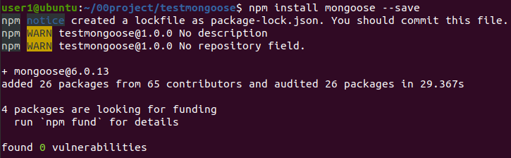

# mongoose使用

## 1.安装

创建node.js项目后，安装mongoose：

要求已经安装并打开了mongodb数据库服务器

## 2.使用流程：

1）引入mongoose：

const mongoose = require('mongoose');

2）连接数据库：

mongoose.connect('mongodb://localhost/test');

其中test是数据库名。

3）创建一个schema：

const schema = {

​    name: String,

​    age: Number,

​    health: String

}

4）创建一个model：

const Cat = mongoose.model('Cat', schema);

5）写入数据库：

