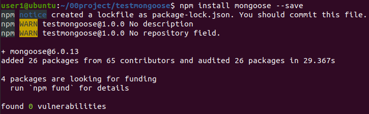
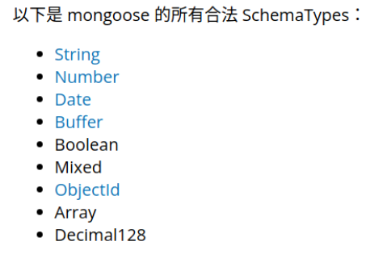
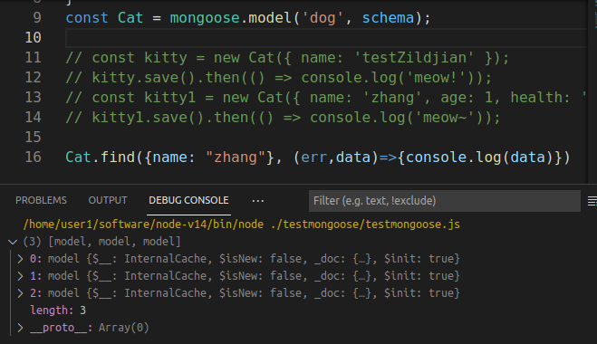
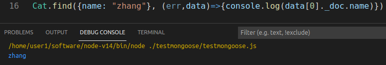

# mongoose使用

## 1.安装

```
touch testmongoose.js
npm init --save
```

创建node.js项目后，安装mongoose：



要求已经安装并打开了mongodb数据库服务器

## 2.使用流程

1）引入mongoose:

const mongoose = require('mongoose');

2）连接数据库

mongoose.connect('mongodb://localhost/test');

其中test是数据库名。

3）创建一个schenama：

const schema={

name:String,

age:Number,

health:String

}

创建的schema只有在创建model时引用才可以起作用：mongoose.model('Cat',schema)。

mongoose有自己的数据类型定义：



创建的schema生效后，储存到数据库的数据必须遵守，否则不能储存，但系统没有原生的错误提示，只是储存一个空数据。

4）创建一个model：

const Model = mongoose.model('Cat',  schema)

model名为Cat

5）写入数据库

const kitty = new Model({ name: 'Zildjian' })

kitty.save()

写入后数据集的名称自动设为cats（使用model名并保证是英文的复数形式，大写改小写、末尾没有s的话加s）

6）数据查询

model名.find({查询条件}，callback(err, 查询结果)=>{})

查询结果是一个Array，data[0]._doc是查询出的文档。





